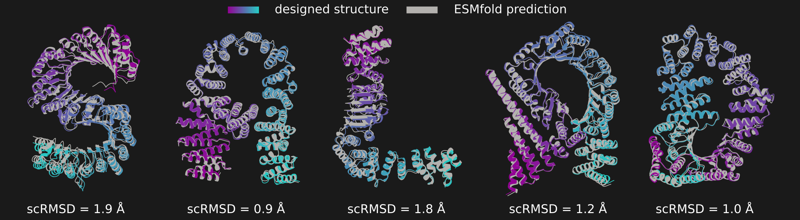
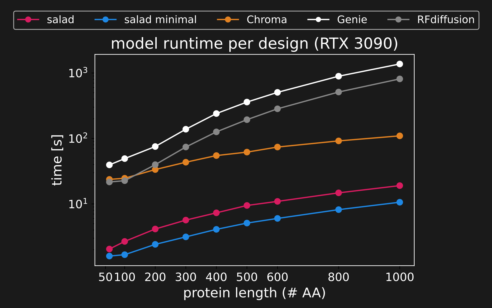

# salad - sparse all-atom denoising
<p align="center">
  
</p>

*Proteins designed to spell out "salad" – the name of this software – overlaid with their ESMfold predicted structures, listing the root mean square deviation between design and prediction (scRMSD).*

## What's salad?

salad (**s**parse **al**l-**a**tom **d**enoising) is the name of a family of machine learning models for controlled protein structure generation.
Like many previous approaches to protein structure generation (e.g. [RFdiffusion](https://github.com/RosettaCommons/RFdiffusion), [Genie2](https://github.com/aqlaboratory/genie2) and [Chroma](https://github.com/generatebio/chroma)), salad is based on denoising diffusion models and is trained to gradually transform random noise into realistic protein structures.

Unlike previous approaches, salad was developed from the ground up with efficiency in mind. salad outperforms its predecessors by a large margin and thus allows for higher-throughput structure generation. To give an example of how fast salad really is in comparison to previous methods, imagine you want to generated a set of 1,000 amino acid proteins on your previous generation RTX 3090. You start generation and go on a 10 minute coffee break. If you used salad with default settings, you come back to ~45 generated strutures. If you used RFdiffusion, you might come back to find one or two.

<p align="center">
  
</p>

*Comparison of per-structure runtime for salad models compared to Chroma, Genie2 and RFdiffusion.*

Like previous models, salad models can generate protein structures for a variety of protein design tasks:
* [unconditional protein generation](#de-novo-protein-design-script)
   up to [~1,000 amino acids](#large-protein-generation-with-domain-shaped-noise)
* [symmetric and repeat protein generation](#symmetric--repeat-protein-generation)
  (currently cyclic and screw-axis symmetry)
* [protein motif scaffolding](#multi-motif-scaffolding)
  (with one or more independent motifs)
* [shape-conditioned protein generation](#shape-conditioned-protein-generation)
* [multi-state protein design](#multi-state-design)

While unconditional protein generation, as well as protein motif scaffolding are fairly standard for current protein structure generators, salad reaches larger proteins up to 1,000 amino acids and can successfully perform on less standard tasks, such as multi-state protein design, shape-conditioned protein generation and repeat protein design. The full extent of what salad can do is described in our [manuscript](TODO).

## What's in this repository?

This repository contains the code for training and evaluating the
models described in "Efficient protein structure generation with
sparse denoising models".

In addition, it provides modules for loading PDB data and implementing
sparse protein models.

**NOTE: This package has been developed and tested on linux. While many**
**things should work as expected on other operating systems, we may not**
**be able to offer adequate support outside of linux at this point.**

## License
Copyright (c) 2025 European Molecular Biology Laboratory (EMBL)

### Code license
Licensed under the Apache License, Version 2.0 (the "License");
   you may not use this file except in compliance with the License.
   You may obtain a copy of the License at

  > > [http://www.apache.org/licenses/LICENSE-2.0](http://www.apache.org/licenses/LICENSE-2.0)

   Unless required by applicable law or agreed to in writing, software
   distributed under the License is distributed on an "AS IS" BASIS,
   WITHOUT WARRANTIES OR CONDITIONS OF ANY KIND, either express or implied.
   See the License for the specific language governing permissions and
   limitations under the License.

### Model parameter license
 <p xmlns:cc="http://creativecommons.org/ns#" xmlns:dct="http://purl.org/dc/terms/"><span property="dct:title">The model parameters</span> are licensed under <a href="https://creativecommons.org/licenses/by/4.0/?ref=chooser-v1" target="_blank" rel="license noopener noreferrer" style="display:inline-block;">Creative Commons Attribution 4.0 International</a></p> 

# Table of contents
- [salad - sparse all-atom denoising](#salad---sparse-all-atom-denoising)
  - [What's salad?](#whats-salad)
  - [What's in this repository?](#whats-in-this-repository)
  - [License](#license)
    - [Code license](#code-license)
    - [Model parameter license](#model-parameter-license)
- [Table of contents](#table-of-contents)
- [Roadmap](#roadmap)
  - [quality of life improvements](#quality-of-life-improvements)
  - [documentation / code cleanup](#documentation--code-cleanup)
  - [features](#features)
- [Getting started](#getting-started)
  - [Installing salad](#installing-salad)
  - [Generating your first proteins](#generating-your-first-proteins)
  - [Sequence redesign and benchmarking](#sequence-redesign-and-benchmarking)
    - [Running ProteinMPNN](#running-proteinmpnn)
    - [Running novobench](#running-novobench)
  - [Using the salad protein autoencoders](#using-the-salad-protein-autoencoders)
- [salad scripts documentation](#salad-scripts-documentation)
  - [_De novo_ protein design script](#de-novo-protein-design-script)
    - [--config](#--config)
    - [--params](#--params)
    - [--out\_path](#--out_path)
    - [--num\_aa](#--num_aa)
    - [--merge\_chains (default: False)](#--merge_chains-default-false)
    - [--num\_steps (default: 500)](#--num_steps-default-500)
    - [--out\_steps (default: 400)](#--out_steps-default-400)
    - [--num\_designs (default: 10)](#--num_designs-default-10)
    - [--prev\_threshold (default: 0.8)](#--prev_threshold-default-08)
    - [--timescale\_pos (default: "cosine(t)")](#--timescale_pos-default-cosinet)
    - [--cloud\_std (default: "none")](#--cloud_std-default-none)
    - [--dssp (default: "none")](#--dssp-default-none)
    - [--template (default: "none")](#--template-default-none)
  - [Large protein generation with domain-shaped noise](#large-protein-generation-with-domain-shaped-noise)
  - [Shape-conditioned protein generation](#shape-conditioned-protein-generation)
  - [Multi-motif scaffolding](#multi-motif-scaffolding)
  - [Symmetric / repeat protein generation](#symmetric--repeat-protein-generation)
    - [--num\_aa](#--num_aa-1)
    - [--replicate\_count](#--replicate_count)
    - [--screw\_translation](#--screw_translation)
    - [--screw\_radius](#--screw_radius)
    - [--screw\_angle](#--screw_angle)
    - [--mix\_output (couple or replicate)](#--mix_output-couple-or-replicate)
    - [--mode (screw or rotation)](#--mode-screw-or-rotation)
    - [--sym\_noise (default: True)](#--sym_noise-default-true)
  - [Multi-state design](#multi-state-design)
- [salad datasets and training](#salad-datasets-and-training)

# Roadmap
While the models and code provided here are functional and reflect the state of salad we used for our [manuscript](TODO), we realize that ther is a lot of room for improvement. As it stands, salad is not as user-friendly as it probably could be and the set of its features is neither a strict superset nor a strict subset of the features provided by other methods for protein structure generation. With this in mind, we provide a roadmap of improvements and features we would like to implement over the following months to make salad as good of a protein design tool as we can.

## quality of life improvements
- [ ] provide Colab notebooks
- [ ] provide docker / apptainer containers
- [ ] provide scripts to run the entire `salad` pipeline in one go
- [ ] implement an improved CLI
- [ ] implement & document a better API for structure-editing

## documentation / code cleanup
- [ ] improve coverage of documentation
- [ ] clean up / structure the `scripts/` directory
- [ ] provide more code examples
- [ ] provide more usage examples of `salad` scripts

## features
- [ ] add partial diffusion option to design scripts
- [ ] implement, train & benchmark small molecule-aware models
- [ ] implement `salad` scripts for protein design tasks
    from the literature
- [ ] implement and document additional hk.Modules
    for implementing protein models

# Getting started
## Installing salad
You can install `salad` the following way:
1. Clone this git repository: `git clone https://github.com/mjendrusch/salad.git`
2. Move to the created directory: `cd salad`
3. If not already created, create and activate a fresh python environment,
   e.g. using `conda`: `conda create -n salad python=3.10`
4. Install `salad` and its prerequisites using `pip`: `pip install -e .`

To use pre-trained `salad` models, download and extract the set of available parameters:
```
wget https://zenodo.org/records/14711580/files/salad_params.tar.gz
tar -xzf salad_params.tar.gz
```

To use the ProteinMPNN sequence design scripts in this repository,
install ProteinMPNN following the instructions [here](https://github.com/dauparas/ProteinMPNN).

To set up design benchmarking using the scripts in this repository,
install `novobench` following the instructions [here](https://github.com/mjendrusch/novobench).

## Generating your first proteins
After installing `salad` and unpacking the parameters, you are ready to design your first proteins. 

Activate your conda environment and run the following command to generate a proteins with length 100 amino acids ([full options](#de-novo-protein-design-script)):

```bash
python salad/training/eval_noise_schedule_benchmark.py \
    --config default_vp \
    --params params/default_vp-200k.jax \
    --out_path output/my_first_protein/ \
    --num_aa 100 \
    --num_designs 10
```

This will create a directory `output/my_first_protein/` containing PDB files for each generated protein structure. Let's go through this command line by line:

`--config default_vp` and `--params params/default_vp-200k.jax` choose a model configuration and a corresponding set of parameters. You will notice that the names of parameter files start with the name of the configuration they are supposed to be used with.

`--out_path` specifies the path to the directory where the salad outputs will be saved.

`--num_aa` specifies how many amino acids you want to design. With this script (eval_noise_schedule_benchmark.py) and config (default_vp), generation will work well up to a total of around 400-500 amino acids. You can also specify multiple chains by separating numbers of amino acids with a colon, e.g. `--num_aa 100:50`.

Finally, `--num_designs` says how many designs you want to generate.

To generate large proteins up to 1,000 amino acids, you should use the following script instead ([full options](#large-protein-generation-with-domain-shaped-noise)):

```bash
python salad/training/eval_ve_large.py \
    --config default_ve_scaled \
    --params params/default_ve_scaled-200k.jax \
    --out_path output/my_large_protein/ \
    --num_aa 1000 \
    --num_designs 10
```

This uses a different configuration and set of parameters better suited for large protein generation, as well as different starting noise to increase designability of large generated structures.

See [below](#salad-scripts-documentation) for a detailed description of all available scripts and their options.

## Sequence redesign and benchmarking
### Running ProteinMPNN
First, install ProteinMPNN in a separate conda environment following the instructions [here](https://github.com/dauparas/ProteinMPNN) and activate the environment.

Then, set an environment variable to point to that directory and activate
the corresponding conda environment you created for ProteinMPNN:
```bash
export PROTEINMPNN=/path/to/proteinmpnn/
conda activate pmpnn
```

You will then be able to run ProteinMPNN for unconditional designs
using:
```bash
bash scripts/pmpnn.sh path/to/pdbs/ path/to/outputs/
```
This will put the generated fasta files in `path/to/outputs/seqs/`.

For motif scaffolding, you can run
```bash
bash scripts/pmpnn_fixed.sh path/to/pdbs/ path/to/motif.pdb path/to/outputs/
```
with a motif PDB file in the [Genie2 motif PDB format](https://github.com/aqlaboratory/genie2?tab=readme-ov-file#format-of-motif-scaffolding-problem-definition-file).

For repeat protein and homooligomer design, you can use
```bash
bash scripts/pmpnn_tied.sh path/to/pdbs/ path/to/outputs/ <repeat length> <repeat count>
```
for example for three repeats of a 50 amino acid repeat unit you could call
```bash
bash scripts/pmpnn_tied.sh path/to/pdbs/ path/to/outputs/ 50 3
```

Finally, to design sequences for multi-state proteins like the ones described in "Efficient protein structure generation with sparse denoising models", you can use
```bash
bash scripts/pmpnn_confchange.sh path/to/pdbs/ path/to/outputs/ 0.5
```

### Running novobench
First, install `novobench` following the instructions [here](https://github.com/mjendrusch/novobench) and activate the corresponding conda environment.

Then, you can point `novobench` at a directory of PDB files and a corresponding directory of ProteinMPNN fasta files to compute ESMfold pLDDTs and scRMSDs:
```bash
python -m novobench.run \
    --pdb-path path/to/pdbs/ \
    --fasta-path path/to/fastas/seqs/ \
    --out-path path/to/outputs/esm/ \
    --model esm
```
The first time you run this, it might take a while, as ESMfold needs to download and cache its parameters.

Running `novobench` will create a directory `predictions/` and a CSV file `scores.csv` in the output directory. `predictions/` contains one subdirectory per PDB file in `path/to/pdbs/`, which will contain one PDB file named `design_N.pdb` for each sequence in the corresponding fasta file, in order (`design_0.pdb`, `design_1.pdb`, etc.) which contain the ESMfold predicted structure for that sequence.

`scores.csv` contains one row per PDB file and fasta sequence, with the `name` of the PDB file, the `index` of the sequence in the fasta file, the `sequence` in one-letter code, and a set of ESMfold-derived metrics:
* `sc_rmsd`, `sc_tm`: RMSD / TMscore between the predicted structure for that sequence and the salad-generated structure.
* `plddt`, `ptm`: ESMfold pLDDT and pTM scores
* `ipae`, `mpae`: mean and minimum interface pAE for complexes

Running `novobench` for multi-state design might require running separate instances of `novobench` for each state. As `salad.train.eval_split_change.py` writes files suffixed `_s0.pdb`, `_s1.pdb`, `_s2.pdb` for the three designed states, you can do this by telling `novobench` to use only designs which contain one of these suffixes:
```bash
python -m novobench.run \
    --pdb-path path/to/pdbs/ \
    --fasta-path path/to/fastas/seqs/ \
    --out-path path/to/outputs/esm/ \
    --model esm \
    --filter-name _s0
``` 

## Using the salad protein autoencoders
While the sparse protein structure autoencoders described in "Efficient protein structure generation with sparse denoising models" are more of a side-note, we still provide scripts and parameters for applying these models to your protein structures.

To use these, please download and unpack the autoencoder parameters first:
```bash
wget https://zenodo.org/records/14711580/files/ae_params.tar.gz
tar -xzf ae_params.tar.gz
```
This will create a directory `ae_params`, which contains the folowing autoencoder checkpoints:
* `small_inner-200k.jax`: sparse autoencoder with inner product-based distance prediction for neighbour selection.
* `small_none-200k.jax`: sparse autoencoder with only structure-based neighbour selection.
* `small_semiequivariant-200k.jax`: same as `small_inner`, but using additional non-equivariant features.

In addition to these checkpoints, there are also corresponding VQ-VAE checkpoints (named e.g. `small_inner_vq-200k.jax`).

As for the above salad models, checkpoints names have the format "< config >-< training step >.jax".

You can then autoencode a protein structure in a PDB file by running:
```bash
python salad/training/eval_structure_autoencoder.py \
    --config small_inner \
    --params ae_params/small_inner-200k.jax \
    --diagnostics True \
    --path path-to-input-pdbs/ \
    --num_recycle 10 \
    --out_path path-to-ae-outputs/
```

Remember to match the config and corresponding parameter names.
`--diagnostics True` writes a numpy archive containing the encoded latents for each structure in the input directory.

# salad scripts documentation
## _De novo_ protein design script
To generate protein structures _de novo_, without structure-editing
or multi-motif scaffolding, you can use the script  `salad/training/eval_noise_schedule_benchmark.py`. It allows the use of different
model configurations and checkpoints and allows to apply simple
constraints such as secondary structure, motifs, length and number of chains, etc.

For example, to use a variance-preserving (VP) salad model to generate
a set of 100 amino acid proteins, you could run the following:

```bash
python salad/training/eval_noise_schedule_benchmark.py \
    --config default_vp \
    --params params/default_vp-200k.jax \
    --out_path path_to_outputs/ \
    --num_aa 100 \
    --num_steps 500 \
    --out_steps 400 \
    --num_designs 10 \
    --prev_threshold 0.8 \
    --timescale_pos "cosine(t)"
```

If instead you wish to generate a complex of a 100 amino acid protein
and a 8 amino acid cyclic peptide ligand, you merely need to set
`--num_aa 100:c8`.

To change the type of model you want to use, choose a different
`--config` and adjust the selected `--params` and other options
accordingly. For example, to instead run a VE variance-expanding (VE)
model, you could run:
```bash
python salad/training/eval_noise_schedule_benchmark.py \
    --config default_ve_scaled \
    --params params/default_ve_scaled-200k.jax \
    --out_path path_to_outputs/ \
    --num_aa 100 \
    --num_steps 500 \
    --out_steps 400 \
    --num_designs 10 \
    --prev_threshold 0.99 \
    --timescale_pos "ve(t)"
```
Here, you need to change the noise schedule (`--timescale_pos`)
to a VE noise schedule and adjust `--prev_threshold` to 0.99 to
prevent over-use of self-conditioning which results in decreased
designability of generated structures. Recommended values for each
model and each setting are described below.

For a VP model with input-dependent variance, you could use:

```bash
python salad/training/eval_noise_schedule_benchmark.py \
    --config default_vp_scaled \
    --params params/default_vp_scaled-200k.jax \
    --out_path path_to_outputs/ \
    --num_aa 100 \
    --num_steps 500 \
    --out_steps 400 \
    --num_designs 10 \
    --prev_threshold 0.8 \
    --timescale_pos "cosine(t)" \
    --cloud_std "default(num_aa)"
```
Here, you need to specify the standard deviation of the
noise distribution using `--cloud_std`. The resulting protein
structures will have a standard deviation of atom positions
close to this value. In this example we set `--cloud_std` to
the `default` function, which was implemented to approximate
the distribution of atom position standard devations for proteins
of a given length `num_aa`.

Further usage examples can be found in the `scripts/` directory,
which contains all generation and benchmarking scripts that were
used for evaluating salad in the corresponding preprint.

Below you can find an in-depth explanation of all parameters that
can be passed to `eval_noise_schedule_benchmark.py`, as well as their
default and recommended values.

### --config
Model configuration in (default_vp, default_vp_scaled, default_ve_scaled).
* `default_vp` is the configuration for the fixed-variance
  variance-preserving (VP) model with variance 10 Å.
* `multimotif_vp` is a version of `default_vp` with multi-motif
  conditioning for motif scaffolding.
* `default_vp_scaled` is the configuration for input-dependent
  variance VP model. The standard deviation of the noise distribution
  has to be specified by setting `--cloud_std <value in angstroms>`
  (see below).
* `default_ve_scaled` is the configuration for the variance-expanding
  (VE) model. Using this configuration requires setting
  `--timescale_pos "ve(t)"`,
  or another diffusion time scale compatible with VE diffusion.
  In addition, it is highly recommended to set
  `--prev_threshold` to a value between 0.95 and 0.99.

The full list of implemented configurations can be found in salad/modules/config/noise_schedule_benchmark.py.

### --params
Path to a set of parameters compatible with the selected `--config`.

Parameters can be downloaded from Zenodo ([10.5281/zenodo.14711580](https://doi.org/10.5281/zenodo.14711580)), or obtained from the most recent `salad` code release on GitHub. Parameter sets are named after the underlying configuration and the conditions the parameter checkpoint was saved at. E.g. `default_vp-200k.jax` is a checkpoint
for the `default_vp` configuration taken at 200,000 training steps.

Currently, the following checkpoints are available:
| name | config | notes |
|---|---|---|
|default_vp-200k.jax|default_vp| ~|
|default_vp_scaled-200k.jax|default_vp_scaled| ~|
|default_ve_scaled-200k.jax|default_ve_scaled| ~|
|multimotif_vp-200k.jax|multimotif_vp| VP multi-motif scaffolding model|
|default_vp-pdb256-200k.jax|default_vp| trained on proteins in PDB with <= 256 amino acids |
|default_vp-synthete256-200k.jax|default_vp| trained on synthetic data with <= 256 amino acids |

### --out_path
Path to the output directory where the generated PDB files
will be saved. The directory will be created if it does not exist.
Running `salad` multiple times with the same `--out_path` will 
replace the outputs of previous runs.

### --num_aa
Specifies the number of amino acids in each chain that will be
generated by `salad`.

`--num_aa` can be:
* an integer like `--num_aa 100`, to specify a single chain
  of amino acids.
* an integer prefixed with "c", like `--num_aa c100`, to specify
  a cyclic chain of amino acids (cyclised with a peptide bond).
* a list of (prefixed) integers, separated by ":" like
  `--num_aa 100:c50`, to generate a complex with two or
  more chains of amino acids (linear or cyclic).

For instance, generating a 100 amino acid proteins with 8
amino acid cyclic ligands would be specified as:
`--num_aa 100:c8`

### --merge_chains (default: False)
Specifies if different chains should use the same chain_index
during generation and instead be separated by a gap in the
residue_index. This is not relevant for complex generation
unless using a model that has not been exposed to protein
complexes during training (e.g. the pdb256 and synthete256
checkpoints).

### --num_steps (default: 500)
The total number of diffusion steps to subdivide the interval
$[0, 1]$ of diffusion times. E.g. to set up diffusion over
200 total steps, specify `--num_steps 200`.

### --out_steps (default: 400)
The number of diffusion steps after which to write an output
PDB file. Similar to RFdiffusion, we return structures early
by default (at 400 steps of 500 total steps), as the resulting
structure shows very little change after that point.

`--out_steps` can be:
* a single integer step-count, like `--out_steps 400`.
* a comma-separated list of step-counts, like `--out_steps 0,100,200`.
  This writes a PDB file at _each_ of the specified step counts.

### --num_designs (default: 10)
The number of generated PDB files.

### --prev_threshold (default: 0.8)
Diffusion time threshold for using self-conditioning.
A `--prev_threshold` of 0.8 signifies that self-conditioning should
be used only for diffusion times between 0.8 and 1.0, early in the
denoising process.

`--prev_threshold` should be set to:
* **0.8** for `vp` and `vp_scaled` models.
  Models still produce reasonable results for values > 0.6 and
  start losing quality for lower values.
* **0.99** for `ve_scaled` models. Values > 0.95 still produce 
  reasonable results, but lower values result in an overabundance
  of beta sheet structures.

### --timescale_pos (default: "cosine(t)")
Function mapping diffusion time to a noise schedule. By default,
this is set to a cosine noise schedule "cosine(t)" for VP models.
For VE models, it should be set to "ve(t)".

`--timescale_pos` can be:
* any expression depending on diffusion time "t", that can be 
  expressed in raw python + numpy (as np).
* one of the following pre-defined noise schedules:
  * cosine(t): a cosine noise schedule
  * ve(t, sigma_max=80.0, rho=7.0): the EDM noise schedule
    where sigma_max is the starting standard deviation and
    rho is the exponent. Results in the manuscript were
    generated with sigma_max = 80 Å and sigma_max = 100 Å

### --cloud_std (default: "none")
Expression defining the standard deviation of the noise distribution
for input-dependent variance VP models (`default_vp_scaled`).

`--cloud_std` can be:
* "none", when not used with a VP-scaled model.
* any expression dependent on `num_aa`, the number of amino acids
  and evaluating to a positive number. E.g. `"num_aa ** 0.4"`
* use the default standard deviation scale `"default(num_aa)"`. 
  **This is a reasonable default for generating protein structures**
  **with VP-scaled diffusion and was used throughout the preprint.**

### --dssp (default: "none")
Secondary structure specification. Overrides `--num_aa`.
This is a string of letters "L" (for Loops), "H" (for Helices),
"E" (for shEets) and "_" (for unspecified secondary structure).
E.g.:
```
___HHHHHHHH___EEEEEE___EEEEEE___EEEEE___HHHHHHHH____
```
Alternatively, you may set `--dssp random`. This randomly samples
a secondary structure string of the shape specified in `--num_aa`
and can be used to increase the diversity of generated structures.

By default, no secondary structure constraints are applied.

**NOTE: currently non-random dssp cannot be mixed with other**
**options, such as cyclicity constraints or symmetry constraints.**
**We plan to address this in a future release.**

### --template (default: "none")
Specifies an ad-hoc template PDB file for single-motif scaffolding.
Template is a comma-separated tuple of a path to a motif PDB file
and a constraint string:
```
path_to/template.pdb,XXXXXXXXXXFFFFFFXXXXFFFFXXXXXFFFFXXXXXXXXX
```
The constraint string specifies the structure of which amino acids
is specified in the template PDB file. The Nth position marked with
"F" in the constraint string corresponds to the Nth amino acid in the
template PDB file. The constraint string **must** contain exactly as
many "F"s as the number of amino acids in `template.pdb`. "X"s specify
amino acids that can be freely designed.

Please make sure to insert "X"s only at positions where the template
PDB file has gaps in the amino acid chain, otherwise you will generate
nonsensical structures.

**NOTE: as the constraint string specifies the number and sequence**
**positions of freely designable amino acids, this overrides**
**--num_aa and is currently incompatible with --dssp specifications.**
**We plan to address this in a future release.**

**For multi-motif scaffolding, please use the `eval_motif_benchmark*.py` scripts.**

## Large protein generation with domain-shaped noise
To generate proteins of size up to 1,000 amino acids, you can use the
script `salad/training/eval_ve_large.py`. It accepts the same 
arguments as `salad/training/eval_ve_large.py`, but it should be used
only with `--config default_ve_scaled` and the corresponding set of
parameters `--params params/default_ve_scaled-200k.jax`.

Generating a set of 1,000 amino acid proteins is as simple as running:
```bash
python salad/training/eval_ve_large.py \
    --config default_ve_scaled \
    --params params/default_ve_scaled-200k.jax \
    --out_path path_to_outputs/ \
    --num_aa 1000 \
    --num_steps 500 \
    --out_steps 400 \
    --num_designs 10 \
    --prev_threshold 0.99 \
    --timescale_pos "ve(t, sigma_max=80.0)"
```

**NOTE: while this script technically accepts secondary structure**
**and template constraints, as well as multi-chain and cyclic** **--num_aa, it has not been tested with that in mind, so we cannot**
**give any guarantees that it will produce meaningful structures**
**if used this way. We plan to address this in a future release.**

## Shape-conditioned protein generation
To generate proteins with a fixed shape, you can use the script
`salad/training/eval_ve_shape.py`. This script is compatible with
VE models (`default_ve_scaled`, `params/default_ve_scaled-200k.jax`).
Instead of taking a `--num_aa` input, it takes a list of coordinates
and amino acid counts in CSV format:
```csv
x,y,z,num_aa
0.0,-11.79,-16.45,100
0.0,-12.09,-3.08,100
0.0,-0.87,-2.98,100
0.0,-11.59,10.40,100
0.0,0.46,21.17,100
0.0,12.01,10.65,100
0.0,11.56,-3.24,100
0.0,12.31,-16.45,100
```
Each row specifies a number of consecutive amino acids to place
at the specified coordinates. VE noise will then arrange amino acids
in a normal distribution around each of the specified locations.

The CSV-file is passed to the script using `--blobs blobs.csv`.
The coordinates can be optionally scaled by a factor using `--blob_scale <factor>`.

To generate letter shapes as described in the manuscript, you can
run:
```
python salad/training/eval_ve_shape.py \
    --params params/default_ve_scaled-200k.jax \
    --out_path path_to_outputs/ \
    --blobs letters/s_shape.csv \
    --blob_scale 1.8 \
    --num_designs 50 \
    --num_steps 500 \
    --out_steps 400
```

The `letters/` directory contains example shape specifications for
a number of letters. Those letter shapes were manualy generated and
`--blob_scale` was gradually adjusted until generated protein 
structures had legible letter-shapes.

This script takes the same denoising-process arguments as
`eval_noise_schedule_benchmark.py`: --num_designs, --num_steps,
--out_steps, --prev_threshold, --config, --params, --timescale_pos.
All values are set to reasonable defaults and changes are unlikely
to be necessary.

## Multi-motif scaffolding
To scaffold one or more protein motifs, you can use the scripts
`salad/training/eval_motif_benchmark.py` and `salad/training/eval_motif_benchmark_nocond.py`.
The former implements (multi-)motif scaffolding for models which
were trained with multi-motif conditioning, while the latter uses
structure-editing to scaffold motifs without explicit motif conditioning.

Both scripts take the same denoising-process arguments as above
(--num_designs, --num_steps,
--out_steps, --prev_threshold, --config, --params, --timescale_pos).
Instead of providing `--num_aa`, both scripts accept a `--template`
argument, e.g. `--template motif_structure.pdb`.

Here, `motif_structure.pdb` must be a motif-annotated PDB file as
described in [the Genie2 repository](https://github.com/aqlaboratory/genie2?tab=readme-ov-file#format-of-motif-scaffolding-problem-definition-file).
The scripts then generate designs according to the specification in that `motif_structure.pdb` file. For example:
```
python salad/training/eval_motif_benchmark.py \
    --config multimotif_vp \
    --params params/multimotif_vp-200k.jax \
    --out_path path_to_outputs/ \
    --num_steps 500 --out_steps 400 --prev_threshold 0.8 \
    --num_designs 1000 --timescale_pos "cosine(t)" \
    --template motif_structure.pdb
```
Using `eval_motif_benchmark.py` requires a multi-motif conditioned
checkpoint, such as `multimotif_vp-200k.jax`. To use _any_ salad
model, you can instead use `eval_motif_benchmark_nocond.py`:
```bash
config=default_vp
python salad/training/eval_motif_benchmark_nocond.py \
    --config $config \
    --params params/${config}-200k.jax \
    --out_path path_to_outputs/ \
    --num_steps 500 --out_steps 400 --prev_threshold 0.8 \
    --num_designs 1000 --timescale_pos "cosine(t)" \
    --template motif_structure.pdb
```
Usage of both scripts is the same.

## Symmetric / repeat protein generation
To generate rotation or superhelical (screw) symmetric repeat proteins,
you can use the script `salad/training/eval_sym.py`.
Currently, this script only supports cyclic or screw-axis symmetries.
By specifying an angle of rotation, distance from center and translation
along the symmetry axis, this allows generating superhelical repeat
proteins with a fully specified geometry.

This script takes the usual denoising process settings (--num_designs, --num_steps, --out_steps, --prev_threshold, --config, --params, --timescale_pos),
as well as `--num_aa` compatible with `eval_noise_schedule_benchmark.py`.
In addition, it requires inputs for `--screw_radius`, which specifies
the repeat unit distance from the symmetry axis in angstroms (center-of-mass radius
of the resulting superhelix); `--screw_angle`, which specifies the
rotation angle around the symmetry axis for successive repeat units;
`--screw_translation`, which specifies the translation along the symmetry
axis in angstroms between two successive repeat units.

For example, generating C3-symmetric repeat proteins works as follows:
```bash
monomer_size=50
repeat_count=3
total_count=$(($monomer_size * $repeat_count))
python salad/training/eval_sym.py \
    --config default_ve_scaled \
    --params params/default_ve_scaled \
    --num_aa $total_count \
    --out_path path_to_output/ \
    --num_steps 500 --out_steps "400" \
    --prev_threshold 0.98 --num_designs 20 --timescale_pos "ve(t)" \ 
    --screw_radius 10.0 --screw_angle 120.0 \
    --screw_translation 0.0 --replicate_count 3 \
    --mode "screw" --mix_output couple \
    --sym_noise True
```
To generate a screw-symmetric structure instead, it suffices to set
`--screw_translation` to a non-zero value.

While this script can be used with any model configuration, generating
screw-symmetric proteins works best with VE models.

A detailed explanation of all arguments to `eval_sym.py` is given below.

### --num_aa
This works as in `eval_noise_schedule_benchmark.py`. However, care needs
to be taken that the chain lengths specified are compatible with the
applied symmetry operation. E.g. for --replicate_count 3, --num_aa needs
to be divisible by 3, or consist of 3 chains of equal length, e.g.:
```
--num_aa 150
--num_aa 50:50:50
```

### --replicate_count
Number of copies of a repeat. E.g. for a C3-symmetric repeat protein,
one should use --replicate_count 3.

### --screw_translation
Translation along the central axis of rotation between two successive
repeat units. If this is 0.0, this will result in a repeat protein
or assembly with cyclic symmetry. Otherwise it will result in a 
superhelical (screw) symmetry.

### --screw_radius
Radius in angstroms at which repeats should be placed from the central
axis of rotation. Allows to control the radius of a cyclic or 
screw-symmetric repeat protein or assembly.

### --screw_angle
Angle of rotation between two successive repeat units around the central
axis of rotation. For designs with --screw_translation 0.0 this needs to
be less than or equal to 360 / --replicate_count, as it will result in
clashing structures otherwise.

### --mix_output (couple or replicate)
Specifies if repeat units should be averaged for symmetrization (couple)
or if one repeat unit should be picked and replicated, discarding all 
other repeat units (replicate).

### --mode (screw or rotation)
If --mode is "screw", aligns repeat units by moving them all to the
origin and inverting the applied rotation. Then, the repeat units (optionally averaged) are moved to a fixed radius from the center
and rotation and translation are applied.

If --mode is "rotation", aligns repeat units by inverting rotation only.
This disables `--screw_radius`, but is closer to the way structures are 
symmetrized in [RFdiffusion](https://github.com/RosettaCommons/RFdiffusion).

### --sym_noise (default: True)
If True, applies symmetry operation (screw or rotation) to the input
noise. Otherwise, only applies symmetry operations to the _output_ of
the denoising model.

## Multi-state design
The script `salad/training/eval_split_change.py` allows the user to
produce backbones for the multi-state protein design task described by
[Lisanza _et al._, 2024](https://www.nature.com/articles/s41587-024-02395-w): Here, the goal is to design a _parent_ protein with
a specified secondary structure, which results in two _child_ proteins
when split into an N-terminal and C-terminal part. These child proteins
should adopt a different secondary structure from the parent.

In addition to the usual denoising process arguments (--num_designs, --num_steps, --out_steps, --prev_threshold, --config, --params, --timescale_pos),
it takes an argument `--dssp`, which specifies the secondary structures
for all parent and child structures, separated by "/".
The secondary structure is specified as a string of
"l/L", "h/H", "e/E" and "_" for loops, helices, sheets and unspecified
secondary structure.
Residues with capitalized secondary structure in the parent sequence
are constrained to have the same _tertiary_ structure in the corresponding
child structure.

For the example described by [Lisanza _et al._, 2024](https://www.nature.com/articles/s41587-024-02395-w) this looks as follows:
```bash
  --dssp "_HHHHHHHHHHHHHlllHHHHHHHHHHHHHllleeeeeellleeeee_______eeeeellleeeeeelllHHHHHHHHHHHHHlllHHHHHHHHHHHHH_/_HHHHHHHHHHHHHLLLHHHHHHHHHHHHHLLLHHHHHHHHHHHHHHHHHHH_/_HHHHHHHHHHHHHHLLLHHHHHHHHHHHHHLLLHHHHHHHHHHHHH_"
```
As the first two and last two helices of the parent are shared with the
respective child, we can fix their tertiary structure during design.

All in all, running multi-state design for this example works as follows:
```bash
config=default_vp
constraint="_HHHHHHHHHHHHHlllHHHHHHHHHHHHHllleeeeeellleeeee_______eeeeellleeeeeelllHHHHHHHHHHHHHlllHHHHHHHHHHHHH_/_HHHHHHHHHHHHHLLLHHHHHHHHHHHHHLLLHHHHHHHHHHHHHHHHHHH_/_HHHHHHHHHHHHHHLLLHHHHHHHHHHHHHLLLHHHHHHHHHHHHH_"
python salad/training/eval_split_change.py
    --config $config \
    --params params/${config}-200k.jax \
    --out_path path_to_outputs/ \
    --num_steps 500 --out_steps 400 \
    --prev_threshold 0.8 --num_designs 1000 \
    --timescale_pos "cosine(t)" \
    --dssp $constraint
```
In principle, any config and set of parameters can be used for this
script, adjusting the denoising settings as described above.

# salad datasets and training
